# VS Code Translucent ✨

Bring sleek translucent aesthetics and background blur to your VS Code editor.

> [!WARNING]
> **Status:** Unstable (Preview)
>
> | IDE / Fork | OS | Version | IDE Version | Status |
> | :--- | :--- | :--- | :---: | :---: |
> | **Visual Studio Code** | Windows 11 `25H2` | `v1.107.0` – `v1.135.0` | same | ✅ Fully Supported |
> | **Antigravity IDE** | Windows 11 `25H2` | `v1.107.0` | `v2.5.5` | ✅ Supported |
> | **Cursor** | Windows | Any | Any | ❓ Untested |
> | **Windsurf** | Windows | Any | Any | ❓ Untested |
> | **VSCodium** | Windows | Any | Any | ❓ Untested |
> | **Trae** | Windows | Any | Any | ❓ Untested |
> | **Positron** | Windows | Any | Any | ❓ Untested |

---

## 📸 Preview

<details open>
<summary><b>✨ Modern UI Preview (Click to expand / collapse)</b></summary>
<br>

| Theme | Preview |
| :--- | :--- |
| **Dark Modern** | 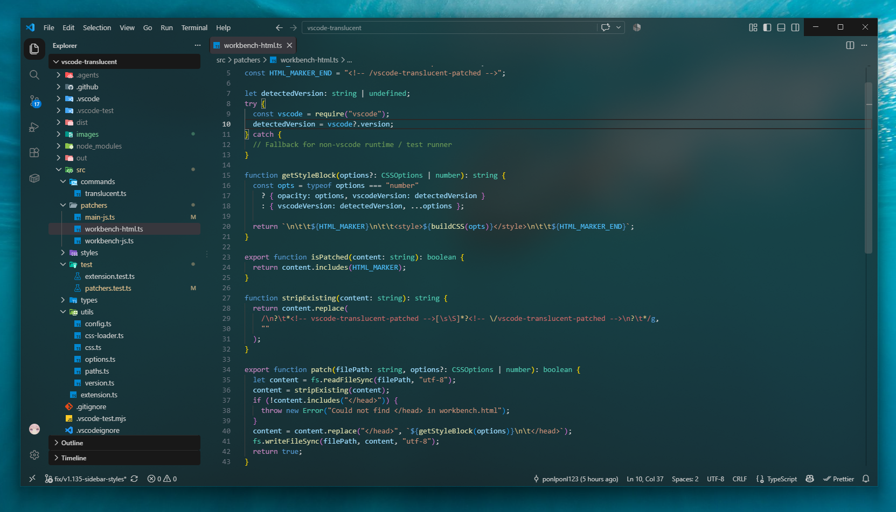 |
| **Light Modern** | 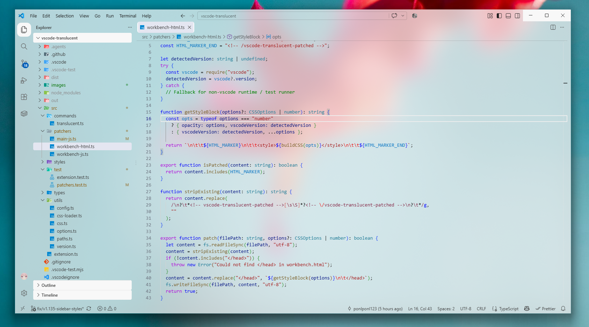 |
| **Dracula** | 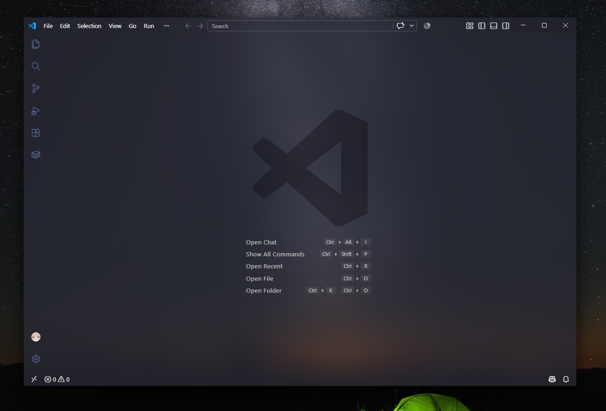 |
| **Dark Red** | 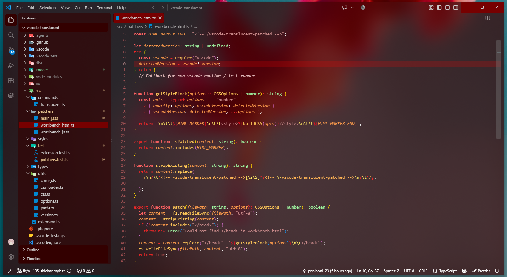 |
| **Tomorrow Night Blue** | 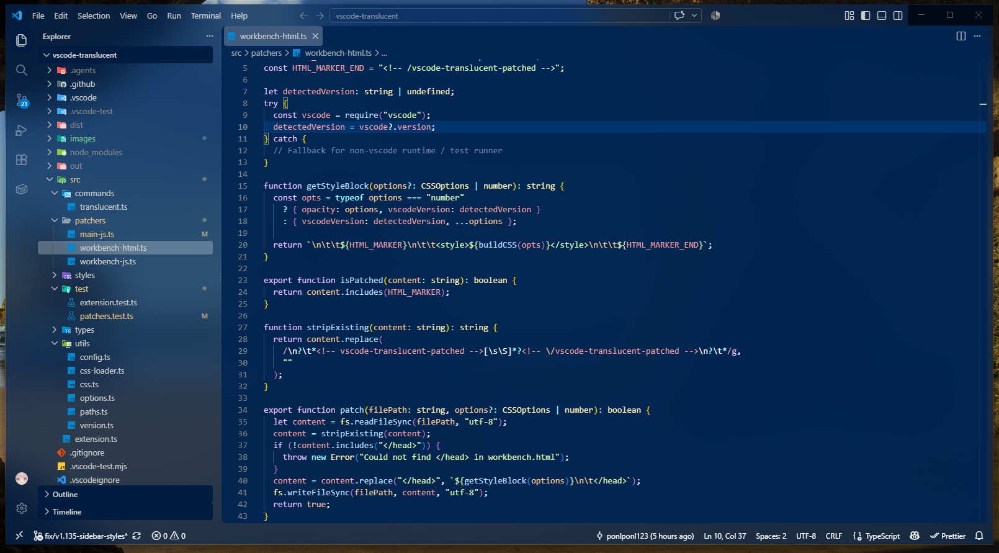 |
| **Light Solarized** | 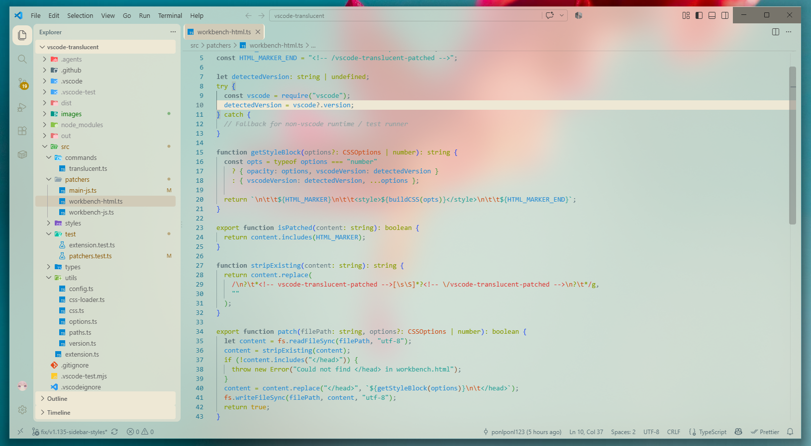 |

</details>

<details>
<summary><b>🎨 Customization Preview (Click to expand / collapse)</b></summary>
<br>

| Configuration | Preview |
| :--- | :--- |
| **Default** | 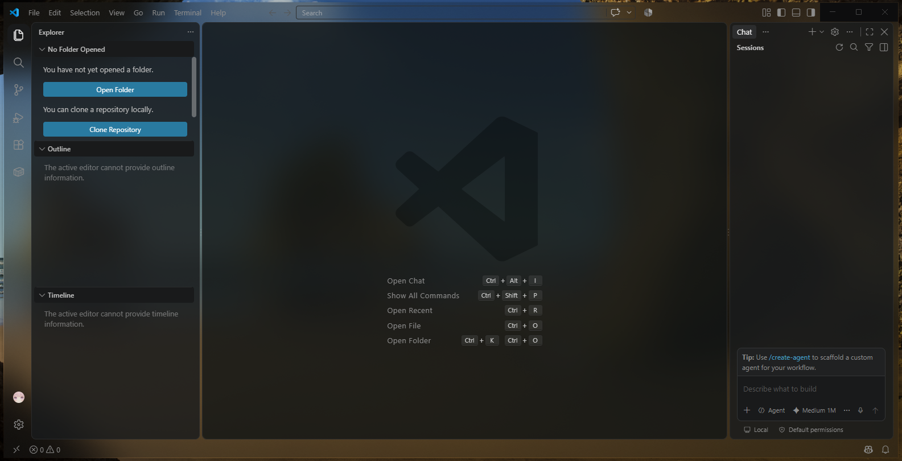 |
| **Fully Transparent** | 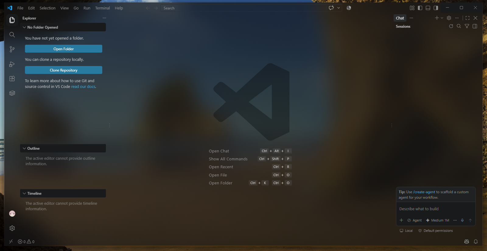 |
| **More Editor Opaque** | 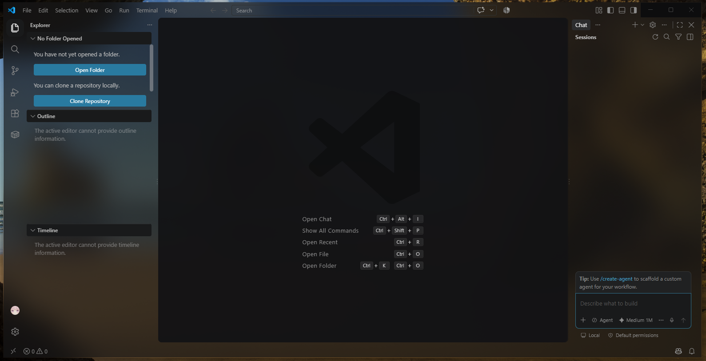 |
| **More Left Sidebar Opaque** | 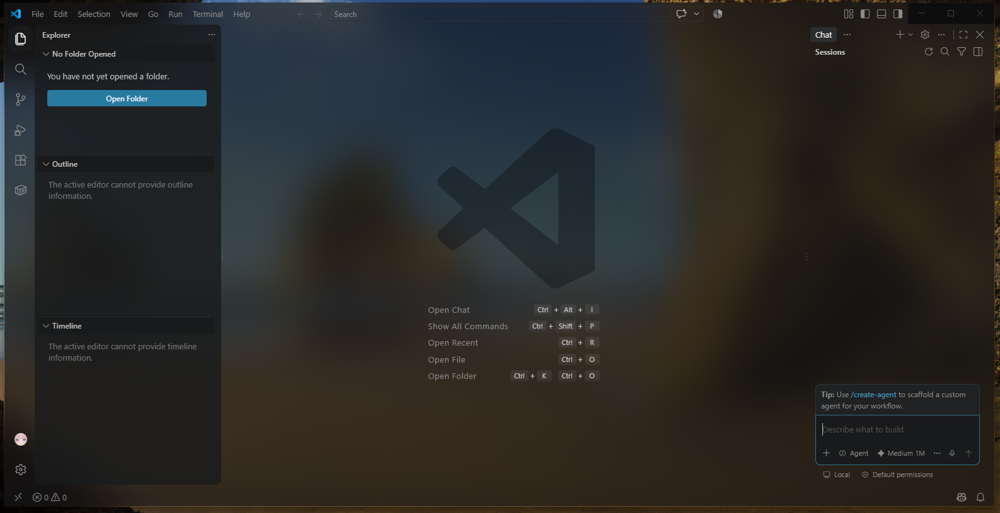 |
| **More Right Sidebar Opaque** | 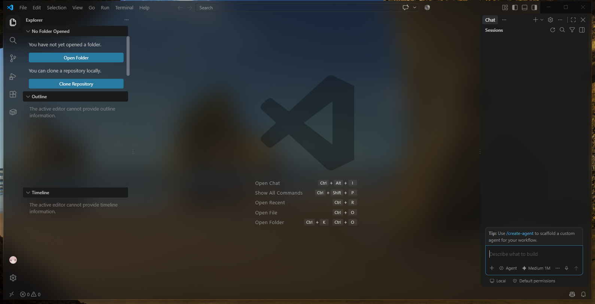 |
| **More Sidebar Opaque** | 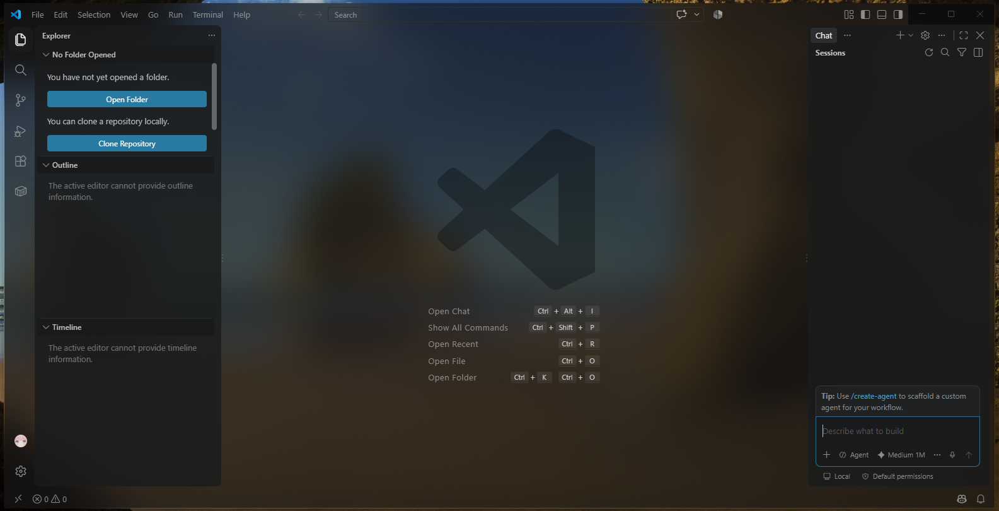 |

> *and more / Fully customization for your style ✨*

</details>

<details>
<summary><b>🏛️ Legacy VS Code Preview (Click to expand / collapse)</b></summary>
<br>

| Theme | Preview |
| :--- | :--- |
| **Dark Theme** | 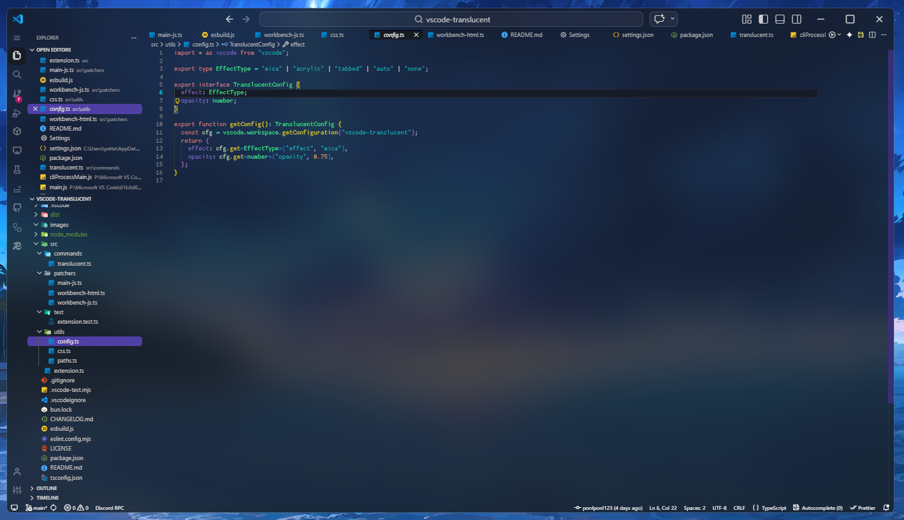 |
| **Dark Green Theme** | 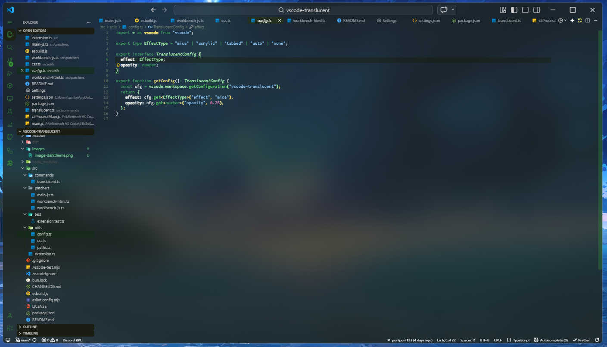 |
| **Light Theme** | 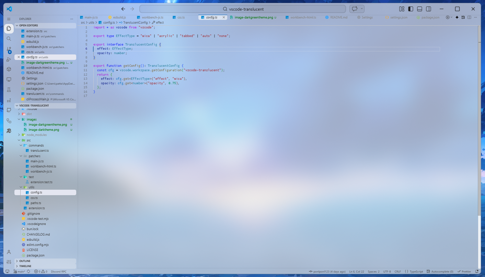 |
| **Light Orange Theme** | 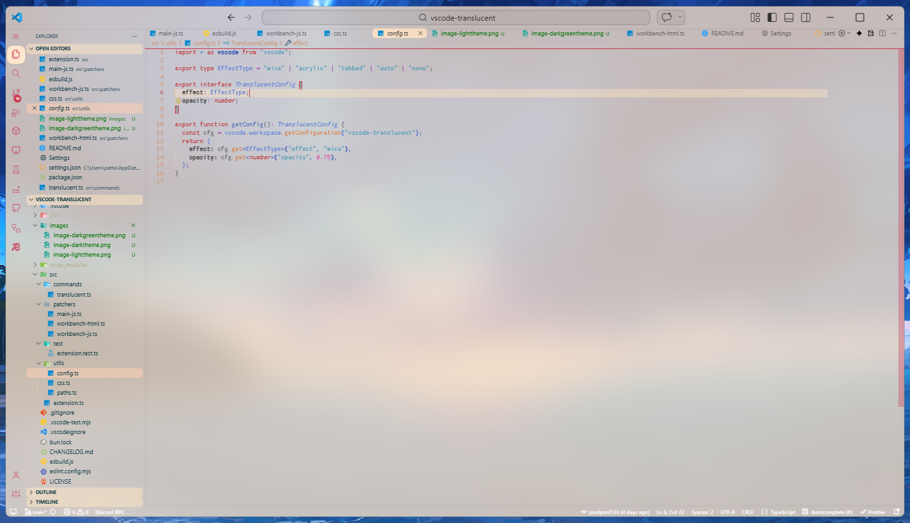 |

</details>

---

## 🚀 Quick Start

> [!IMPORTANT]
> **Prerequisite:** This extension makes VS Code's workbench transparent, but **requires an external tool** to force backdrop effects (blur / mica / acrylic) on Windows desktop windows — such as [Mica For Everyone](https://github.com/MicaForEveryone/MicaForEveryone), Windhawk Mods (e.g., [Translucent Windows](https://windhawk.net/mods/translucent-windows)), or similar utilities.

1. **Install** this extension from the VS Code Marketplace.
2. Open the Command Palette (`Ctrl + Shift + P`) and run:
   ```
   Translucent: Enable
   ```
3. **Restart VS Code** completely (a full relaunch, not just reloading the window).
4. Configure your preferred window effect tool:
   - **Mica For Everyone**: Add a process rule for `Code`, and under the **Advanced** tab, check **Enable blur behind**.
   - **Windhawk**: Enable and configure the **Translucent Windows** mod for `Code.exe`.
5. Enjoy your translucent workspace!

---

## ⚙️ Configuration

Tune opacity levels, container borders, and UI elements directly in your VS Code Settings (`Ctrl + ,`):

| Setting | Type | Default | Description |
| :--- | :--- | :---: | :--- |
| `vscode-translucent.opacity` | `number` (`0.0`-`1.0`) | `0.4` | Default background opacity for workbench UI. |
| `vscode-translucent.editorContainerBackgroundOpacity` | `number` (`0.0`-`1.0`) | `0.4` | Background opacity for the editor container. |
| `vscode-translucent.leftSidebarContainerBackgroundOpacity` | `number` (`0.0`-`1.0`) | `0.8` | Background opacity for the primary sidebar. |
| `vscode-translucent.rightSidebarContainerBackgroundOpacity` | `number` (`0.0`-`1.0`) | `0.8` | Background opacity for the secondary / auxiliary bar. |
| `vscode-translucent.editorContainerBorderVisible` | `boolean` | `true` | Show or hide the editor container border. |
| `vscode-translucent.leftSidebarContainerBorderVisible` | `boolean` | `true` | Show or hide the primary sidebar border. |
| `vscode-translucent.rightSidebarContainerBorderVisible` | `boolean` | `true` | Show or hide the secondary sidebar border. |
| `vscode-translucent.applyToJupyterNotebook` | `boolean` | `false` | Force transparent background on Jupyter notebook cells. |

> [!TIP]
> After adjusting opacity or border options, reload window (`Ctrl + R`) to apply changes.

---

## 🛠️ Troubleshooting & Known Issues

### 1. Window Flickering with External Blur Tools
If you experience window flickering with tools like Mica For Everyone or Windhawk, disable GPU compositing by adding `--disable-gpu-compositing` to your VS Code launch target:

```bat
"C:\Users\<YourUsername>\AppData\Local\Programs\Microsoft VS Code\Code.exe" --disable-gpu-compositing
```
> **Note:** Replace `<YourUsername>` with your actual Windows username.

---

### 2. Terminal Font Rendering Glitches

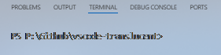

VS Code's hardware-accelerated terminal canvas may cause font artifacts when backdrop blur is active. Disabling terminal GPU acceleration resolves this cleanly:

1. Open Settings (`Ctrl + ,`).
2. Search for: `terminal.integrated.gpuAcceleration`
3. Set the value to `off`.
4. Relaunch your terminal or restart VS Code.

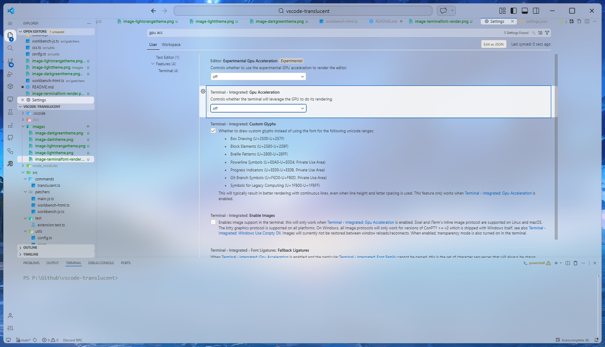

---

## 🗑️ Uninstallation

To cleanly remove the extension:

1. Open Command Palette (`Ctrl + Shift + P`) and run:
   ```
   Translucent: Disable
   ```
2. Remove any custom rules or hooks for `Code` in your backdrop tool (e.g., **Mica For Everyone** or **Windhawk**).
3. Uninstall the extension from the VS Code Extensions tab.

---

## ☕ Support

If you enjoy using this extension and find it helpful in your daily setup, feel free to support future development:

[](https://buymeacoffee.com/ponlponl123)

